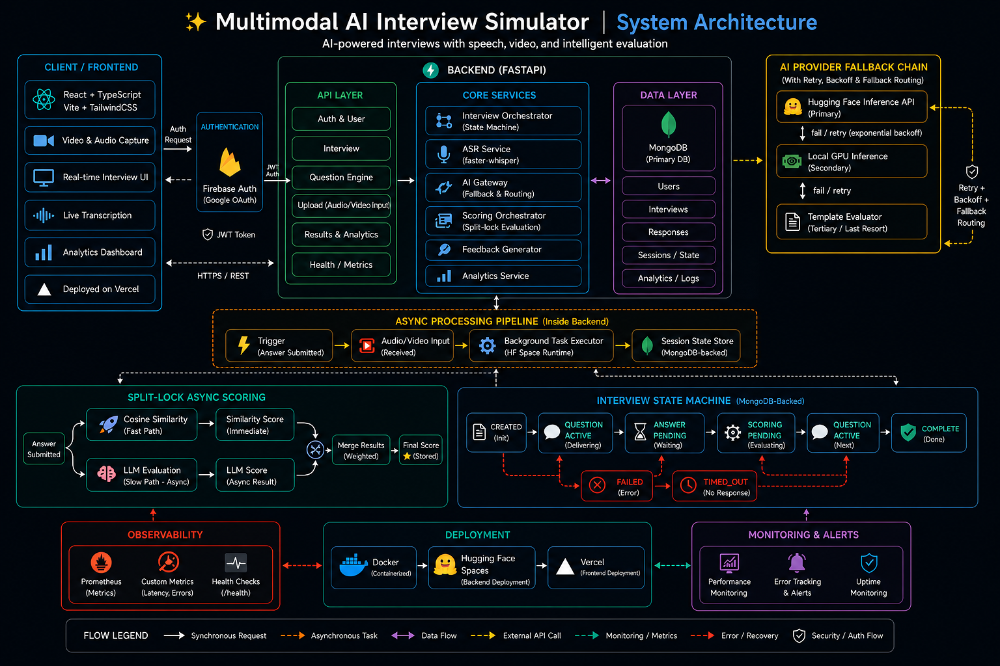

# 💫 About Me:
🔭 I’m currently working on production AI systems and a multimodal AI interview simulator 🤝 I’m looking to collaborate on applied AI, FastAPI, backend, and LLM orchestration projects 💬 I’m looking for help with scaling inference, observability, and real-world AI deployment patterns 🌱 I’m currently learning LLM orchestration, system design, and backend reliability 💬 Ask me about FastAPI, PyTorch, faster-whisper, MongoDB, Firebase, and building AI products ⚡ Fun fact: I enjoy turning complex AI workflows into practical, resilient systems

---

# 🚀 Featured Project

## Multimodal AI Interview Simulator

Production-oriented AI interview platform with multimodal evaluation, async scoring pipelines, fallback AI orchestration, resume-aware interview generation, and real-time analytics.

### Key Engineering Features

* FastAPI + React architecture
* faster-whisper ASR pipeline
* Qwen2.5-7B inference orchestration
* MongoDB-backed interview state machine
* Multi-provider AI fallback gateway
* Prometheus observability
* Dockerized Hugging Face deployment

🔗 Live Demo: [https://ascent-intrv.vercel.app](https://ascent-intrv.vercel.app)
🔗 Repository: [https://github.com/faais-k/Multimodal-AI-interview-sim](https://github.com/faais-k/Multimodal-AI-interview-sim)

## 🏗️ System Architecture

  

---

## 🌐 Socials:
  

# 💻 Tech Stack:
                              
# 📊 GitHub Stats:
 
 

---

